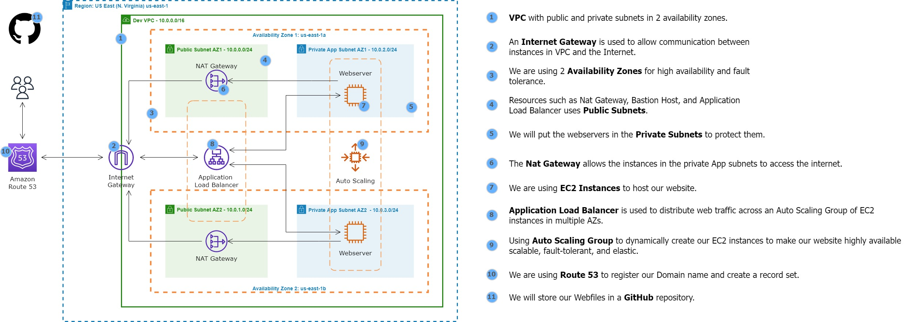

---
# Project README

## Static Web App Deployment on AWS using DevOps Principles

This repository contains scripts and configurations for deploying a static HTML web app on AWS. The project utilizes various AWS services and follows DevOps best practices for high availability, fault tolerance, and scalability.

### Architecture Overview

The deployment is based on the following AWS resources:

- **VPC (Virtual Private Cloud):**
  - Public and private subnets across two availability zones for high availability.
  - Internet Gateway for communication between instances in the VPC and the internet.

- **Networking Components:**
  - Nat Gateway, Bastion Host, and Application Load Balancer use Public Subnets.
  - EC2 instance Connect Endpoint for secure connections to resources in public and private subnets.
  - Nat Gateway enables instances in private subnets to access the internet.

- **Resource Placement:**
  - Web server and database servers are placed in the private subnets to enhance security.

- **Web Hosting:**
  - EC2 Instances are used to host the static website.
  - Application Load Balancer distributes web traffic across an Auto Scaling Group of EC2 instances in multiple Availability Zones.

- **Auto Scaling and Elasticity:**
  - Auto Scaling Group dynamically creates EC2 instances to ensure high availability, scalability, fault tolerance, and elasticity.

- **Domain Management:**
  - Route 53 is used to register the domain name and create a record set for easy access to the web application.

- **Source Code Management:**
  - GitHub is utilized to store web files and provide version control.

### Deployment Script

The following script automates the deployment of the web app on an EC2 instance:

```bash
#!/bin/bash
sudo su
yum update -y
yum install -y httpd
cd /var/www/html
wget https://github.com/azeezsalu/jupiter/archive/refs/heads/main.zip
unzip main.zip
cp -r jupiter-main/* /var/www/html/
rm -rf jupiter-main main.zip
systemctl enable httpd 
systemctl start httpd
```

This script performs the following tasks:

1. Updates the system packages.
2. Installs the Apache HTTP server (`httpd`).
3. Downloads the web app files from the GitHub repository.
4. Extracts and copies the files to the Apache web server's document root.
5. Enables and starts the Apache service.

### Getting Started

Follow these steps to deploy the web app:

1. **Clone the Repository:**
   ```bash
   git clone https://github.com/your-username/your-repository.git
   cd your-repository
   ```

2. **Modify Configuration:**
   - Update the AWS configuration files (if necessary).
   - Modify the script to use your GitHub repository.

3. **Run Deployment Script:**
   ```bash
   ./deploy-script.sh
   ```

4. **Access the Web App:**
   - Once deployed, access the web app using the domain registered in Route 53.

### Additional Notes

- Ensure proper IAM roles and permissions for EC2 instances, Auto Scaling, and other AWS services.
- Monitor and configure security groups to control traffic to and from instances.
- Regularly update and review configurations for security and optimization.

